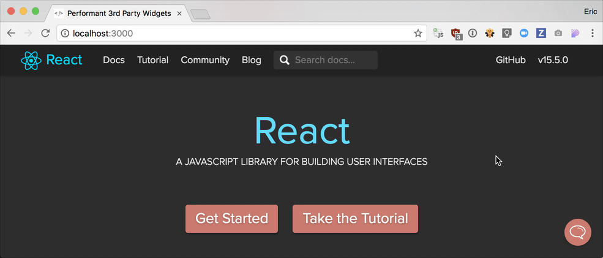

# Performant 3rd Party Widgets

> https://www.meetup.com/houston-js/events/239147131/

## Demo

## Features

### Building
- [ ] Webpack
- [ ] Code-splitting
- [ ] Offline-support?

### Bundle optimization
- [ ] `webpack-bundle-analyzer`
- [ ] `react` to `preact`
- [ ] `lodash-webpack-plugin`

### CSS-in-JS
- [ ] Example for when styles are generated at runtime
- [ ] `styled-components`  + costs
- [ ] `glamour` + costs
- [ ] Other examples (+ costs)?

### Gotchas
- [ ] CSS specificity
- [ ] Multiple instances
- [ ] What else?
